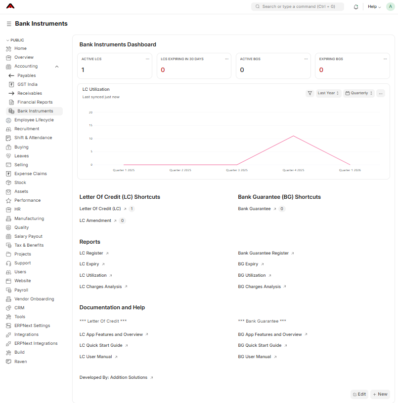

# Bank Instruments Management

A comprehensive ERPNext application for managing the complete lifecycle of Bank Instruments including Letters of Credit (LC) and Bank Guarantees (BG) in import-export businesses. This app streamlines operations, tracking, reporting, and compliance with intelligent automation and robust reporting capabilities for both LCs and BGs.

## Overview

The **Bank Instruments Management App** (`addsol_bank_instruments`) is designed for import-export companies, banks, trading houses, and manufacturing businesses that deal with international trade and financial instruments. It provides end-to-end management of both Import and Export LCs, as well as various types of Bank Guarantees, supporting multiple instrument types with comprehensive tracking and automation.



### **Letter of Credit (LC) Module**

**Key capabilities include:**
- Complete LC lifecycle management from opening to settlement
- Automated calculations for balance amounts and utilization tracking
- Comprehensive document management with submission tracking
- Multi-shipment support for partial deliveries
- Detailed charges and cost tracking
- Smart validations and workflow automation
- Four powerful reports for expiry monitoring, utilization analysis, and cost management
- Seamless integration with ERPNext's Purchase Orders, Sales Orders, and Delivery Notes

**Supported LC Types:**
- Sight LC
- Usance LC
- Deferred Payment LC
- Revolving LC
- Transferable LC
- Back-to-Back LC
- Standby LC

### **Bank Guarantee (BG) Module**

**Key capabilities include:**
- Complete BG lifecycle management from issuance to closure
- Automated expiry monitoring and alert system
- Comprehensive utilization tracking and amount management
- Extension and amendment support
- Multiple BG types including Performance, Financial, and Advance Payment Guarantees
- Detailed charges and fee tracking
- Smart validations and compliance checks
- Four powerful reports for expiry monitoring, utilization analysis, and charges management
- Integration with ERPNext's Projects, Sales Orders, and Purchase Orders

**Supported BG Types:**
- Performance Guarantee
- Financial Guarantee
- Advance Payment Guarantee
- Warranty Guarantee
- Bid Bond
- Customs Guarantee
- Retention Money Guarantee

## Business Benefits

**For Letters of Credit:**
- Reduce manual tracking errors by 80%
- Ensure compliance with LC terms and conditions
- Provide real-time visibility of LC utilization
- Prevent over-utilization beyond tolerance limits
- Complete audit trail for compliance and reporting

**For Bank Guarantees:**
- Automated expiry alerts prevent lapses and penalties
- Real-time utilization tracking for better cash flow management
- Comprehensive audit trail for regulatory compliance
- Reduced manual effort in monitoring and tracking
- Smart notifications for critical events and deadlines

**Overall Benefits:**
- Unified platform for all bank instruments management
- Streamlined workflows and reduced operational overhead
- Enhanced visibility and control over financial instruments
- Improved compliance and risk management
- Cost-effective solution replacing multiple systems

## Documentation

### **Letter of Credit Documentation**
- **[LC Quick Start Guide](addsol_bank_instruments/documentation/lc/lc_quick_start.md)** - Get up and running in 5 minutes
- **[LC App Features](addsol_bank_instruments/documentation/lc/lc_app_features.md)** - Comprehensive feature list and capabilities
- **[LC User Manual](addsol_bank_instruments/documentation/lc/lc_user_manual.md)** - Complete user guide with detailed instructions

### **Bank Guarantee Documentation**
- **[BG Quick Start Guide](addsol_bank_instruments/documentation/bg/bg_quick_start_guide.md)** - Get up and running in 5 minutes
- **[BG App Features](addsol_bank_instruments/documentation/bg/bg_features.md)** - Comprehensive feature list and capabilities
- **[BG User Manual](addsol_bank_instruments/documentation/bg/bg_user_manual.md)** - Complete user guide with detailed instructions

### **Reports Documentation**
- **[LC Reports Guide](addsol_bank_instruments/documentation/lc/lc_reports.md)** - Understanding LC reports and analytics
- **[BG Reports Guide](addsol_bank_instruments/documentation/bg/bg_reports.md)** - Understanding BG reports and analytics

## Installation

You can install this app using the [bench](https://github.com/frappe/bench) CLI:

```bash
cd $PATH_TO_YOUR_BENCH
bench get-app $URL_OF_THIS_REPO --branch develop
bench install-app addsol_bank_instruments
```

### Prerequisites

- ERPNext Version 15
- Basic understanding of Letters of Credit and Bank Guarantees
- Import-Export business operations knowledge

### Quick Start

**For Letters of Credit:**
1. Navigate to "Bank Instruments" workspace
2. Click on "Letter Of Credit (LC)" shortcut
3. Create your first LC
4. Link to Purchase/Sales Order
5. Add required documents
6. Track shipments
7. Monitor with reports

**For Bank Guarantees:**
1. Navigate to "Bank Instruments" workspace
2. Click on "Bank Guarantee" shortcut
3. Create your first BG
4. Link to Project/Sales Order/Purchase Order
5. Set expiry dates and alerts
6. Track utilization and extensions
7. Monitor with reports

## Features

### **Core Features**

**Letter of Credit Management:**
- LC creation and lifecycle management
- Amendment tracking and processing
- Document submission and tracking
- Shipment management and tracking
- Balance calculation and utilization monitoring
- Automated expiry notifications
- Comprehensive reporting and analytics

**Bank Guarantee Management:**
- BG creation and lifecycle management
- Extension and amendment processing
- Utilization tracking and amount management
- Expiry monitoring and alerts
- Charges and fee tracking
- Automated notifications for critical events
- Comprehensive reporting and analytics

**Common Features:**
- Role-based access control
- Automated notifications and alerts
- Comprehensive audit trail
- Advanced reporting and analytics
- Integration with ERPNext modules
- Mobile-responsive interface
- Multi-currency support

### **Reports**

**LC Reports:**
- LC Register - Complete list of all LCs with status
- LC Utilization Report - Analysis of LC utilization and balances
- LC Expiry Report - Monitor LCs expiring within specified periods
- LC Charges Analysis - Track and analyze LC-related charges

**BG Reports:**
- BG Register - Complete list of all BGs with status
- BG Utilization Report - Analysis of BG utilization and amounts
- BG Expiry Report - Monitor BGs expiring within specified periods
- BG Charges Analysis - Track and analyze BG-related charges

### **Notifications**

**LC Notifications:**
- LC submission notifications to relevant stakeholders
- LC expiry alerts at 30, 15, 7, 3, and 1 days before expiry
- Amendment notifications
- Document submission reminders

**BG Notifications:**
- BG submission notifications to relevant stakeholders
- BG expiry alerts at 30, 15, 7, 3, and 1 days before expiry
- Extension notifications
- Utilization threshold alerts

## Integration

### **ERPNext Integration**
- **Sales Orders**: Link LCs and BGs to sales transactions
- **Purchase Orders**: Link LCs and BGs to purchase transactions
- **Projects**: Link BGs to project-based guarantees
- **Delivery Notes**: Track shipments against LCs
- **Accounts**: Automatic charge posting and tracking
- **Users and Roles**: Comprehensive permission management

### **External Integration**
- **Bank Systems**: Ready for integration with banking platforms
- **Email Systems**: Automated notifications and alerts
- **Document Management**: Support for external document storage

## Support and Contributing

### **Contributing**

This app uses `pre-commit` for code formatting and linting. Please [install pre-commit](https://pre-commit.com/#installation) and enable it for this repository:

```bash
cd apps/addsol_bank_instruments
pre-commit install
```

Pre-commit is configured to use the following tools for checking and formatting your code:

- ruff
- eslint
- prettier
- pyupgrade

### **Support**

For support and queries:
- **Documentation**: Refer to the comprehensive documentation guides
- **Issues**: Report bugs and feature requests on the repository
- **Community**: Join our community for discussions and best practices

## License

MIT License - Free for commercial and personal use

---

**Developed by Addition Solutions**
*Innovative solutions for modern business challenges*

Visit us at: [https://aitspl.com](https://aitspl.com)

Commercial ERPNext customization and implementation services available.
Contact: erpnext@aitspl.com